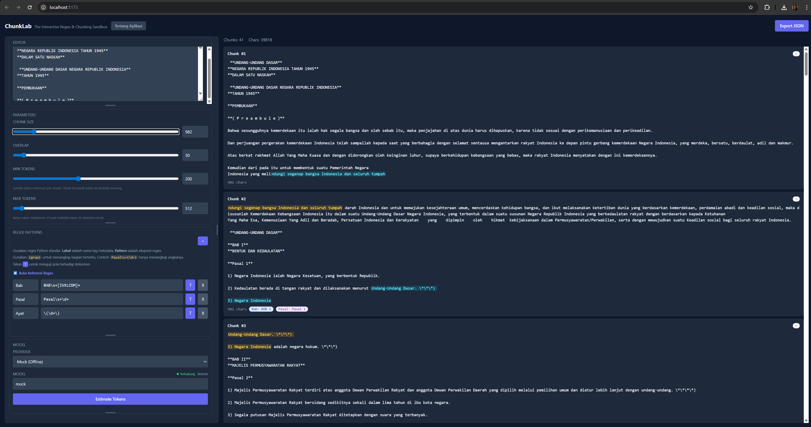

<div align="center">
  
  
  # ChunkLab

  [](https://github.com/ziffan/ChunkLab/actions/workflows/test.yml)
  [](https://github.com/ziffan/ChunkLab/actions/workflows/lint.yml)
  [](https://github.com/ziffan/ChunkLab/actions/workflows/security.yml)
  [](https://github.com/ziffan/ChunkLab/actions/workflows/dco.yml)
  [](LICENSE)
  [](https://www.python.org/)
  [](https://reactjs.org/)

  **The ultimate developer sandbox for text chunking experimentation.**
</div>

---

### 🚀 Pitch

**EN:** ChunkLab is a powerful browser-based sandbox designed for developers to test, visualize, and validate text chunking pipeline configurations. Optimize your RAG (Retrieval-Augmented Generation) ingestion process with real-time feedback and detailed metrics.

**ID:** ChunkLab adalah sandbox berbasis browser yang dirancang bagi pengembang untuk menguji, memvisualisasikan, dan memvalidasi konfigurasi pipeline chunking teks. Optimalkan proses ingestion RAG (Retrieval-Augmented Generation) Anda dengan umpan balik real-time dan metrik mendetail.

---

### 📸 Screenshot

<div align="center">
  
</div>

---

### ⚡ Quickstart

#### Prerequisites
- Python 3.12+
- Node.js 18+
#### 1. Clone & Setup Backend
```bash
git clone https://github.com/ziffan/ChunkLab.git
cd ChunkLab/backend
```
python -m venv .venv
# Windows:
.venv\Scripts\activate
# Linux/macOS:
source .venv/bin/activate
pip install -r requirements.txt
cp .env.example .env
python main.py
```

#### 2. Setup Frontend
```bash
cd ../frontend
npm install
npm run dev
```

#### 3. Access
Open [http://localhost:5173](http://localhost:5173) in your browser.

---

### 🏗️ Architecture

- **Backend:** FastAPI (Python 3.12) - Handles regex processing, tokenization (Tiktoken), and chunking logic.
- **Frontend:** React + TailwindCSS + Vite - Interactive UI for configuration and visualization.
- **Processing Engine:** Custom chunking logic with support for various strategies (Recursive, Semantic, Fixed-size).

---

### ✨ Feature List

- [x] **Live Visualization:** Real-time preview of how text is split into chunks.
- [x] **Multiple Tokenizers:** Support for GPT-4, Llama, and custom token counters.
- [x] **Regex Playground:** Test and debug custom split patterns.
- [x] **Metadata Extraction:** Automatically extract titles, headers, and keywords from chunks.
- [x] **Provider Mocks:** Integrated mocks for major LLM providers (OpenAI, Gemini, Anthropic).
- [ ] **Exportable Configs:** Export your validated pipeline to JSON/YAML for production use.

---

### 📚 Documentation

- [Getting Started](docs/getting-started.md)
- [API Reference](backend/README.md) *(Coming Soon)*
- [Deployment Guide](docs/deployment.md) *(Coming Soon)*

---

### 📄 License

This project is licensed under the **Apache License 2.0**. See the [LICENSE](LICENSE) file for details.

Copyright © 2026 Ziffan (Ziffany Firdinal).
