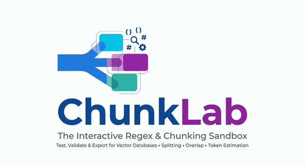
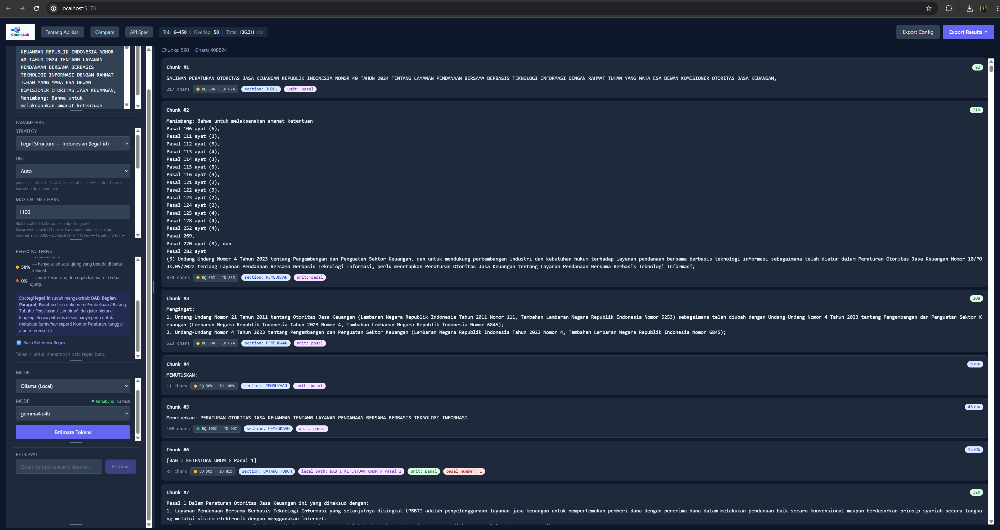

<div align="center">
  
  
  # ChunkLab

  [](https://github.com/ziffan/ChunkLab/actions/workflows/test.yml)
  [](https://github.com/ziffan/ChunkLab/actions/workflows/lint.yml)
  [](https://github.com/ziffan/ChunkLab/actions/workflows/security.yml)
  [](https://github.com/ziffan/ChunkLab/actions/workflows/dco.yml)
  [](LICENSE)
  [](https://www.python.org/)
  [](https://reactjs.org/)

  **The interactive sandbox for text chunking experimentation — built for RAG pipelines.**
</div>

---

### Pitch

**EN:** ChunkLab is a browser-based sandbox for testing, visualizing, and validating text chunking strategies before deploying them into a RAG (Retrieval-Augmented Generation) pipeline. It supports seven chunking strategies (including two purpose-built for Indonesian text), per-chunk quality metrics, semantic retrieval simulation, side-by-side comparison mode, and multi-format export.

**ID:** ChunkLab adalah sandbox berbasis browser untuk menguji, memvisualisasikan, dan memvalidasi strategi chunking teks sebelum diterapkan ke pipeline RAG. Mendukung tujuh strategi chunking (termasuk dua khusus teks Indonesia), quality metrics per chunk, simulasi retrieval semantik, mode perbandingan dua konfigurasi, dan export multi-format.

---

### Screenshot

<div align="center">
  
</div>

---

### Quickstart

**Prerequisites:** Python 3.12+, Node.js 18+

#### 1. Backend

```bash
git clone https://github.com/ziffan/ChunkLab.git
cd ChunkLab

python -m venv backend/.venv

# Windows
backend\.venv\Scripts\activate
# Linux/macOS
source backend/.venv/bin/activate

pip install -r backend/requirements.txt
cp backend/.env.example backend/.env   # lalu sesuaikan jika perlu

python -m backend.main
# Backend tersedia di http://127.0.0.1:8000
```

#### 2. Frontend

```bash
cd frontend
npm install
npm run dev
# UI tersedia di http://localhost:5173
```

#### 3. Retrieval (opsional)

Untuk mengaktifkan fitur Retrieval Simulation, install dependensi tambahan:

```bash
pip install -r requirements-retrieval.txt
```

Model yang digunakan: `intfloat/multilingual-e5-large` (mendukung Bahasa Indonesia dan 100+ bahasa lain).

---

### Kebutuhan Sistem

| Komponen | Minimum | Rekomendasi |
|---|---|---|
| **Python** | 3.12 | 3.12+ |
| **Node.js** | 18 | 20 LTS |
| **RAM (mode dasar)** | 512 MB | 1 GB |
| **RAM (dengan Retrieval)** | 4 GB | 8 GB |
| **Disk (model embedding)** | — | ~1 GB (multilingual-e5-large, diunduh otomatis) |
| **GPU** | Tidak wajib | CUDA GPU mempercepat encoding retrieval |
| **OS** | Windows 10 / Ubuntu 20.04 / macOS 12 | Windows 11 / Ubuntu 22.04 / macOS 14 |

> **Catatan:** Fitur Retrieval Simulation membutuhkan RAM ekstra karena model embedding `intfloat/multilingual-e5-large` (~560 MB) di-load ke memori. Tanpa fitur ini, aplikasi berjalan ringan di mesin apa pun yang memenuhi syarat Python 3.12 dan Node.js 18.

---

### Fitur

| Fitur | Status |
|---|---|
| **7 strategi chunking** — Fixed, Recursive, Token-aware (tiktoken), Sentence/pysbd (legacy), Sentence Indonesia (`sentence_id`), Legal Indonesia (`legal_id`), Markdown Structure | ✅ |
| **File upload** — drag-and-drop / klik untuk `.txt` / `.md` hingga 500 KB | ✅ |
| **Quality metrics** per chunk — Boundary Quality, Information Density, completeness flag | ✅ |
| **Markdown breadcrumb** — jalur header H1 › H2 › H3 otomatis per chunk | ✅ |
| **Regex metadata** — ekstraksi otomatis dengan capture group | ✅ |
| **Retrieval simulation** — query semantik top-K via `multilingual-e5-large` (opsional) | ✅ |
| **Comparison mode** — dua konfigurasi side-by-side dengan diff stats | ✅ |
| **Export multi-format** — JSON, JSONL (siap Vector DB), YAML sebagai file download | ✅ |
| **Config export** — simpan konfigurasi strategy + params + regex ke JSON | ✅ |
| **API Spec download** — unduh OpenAPI spec langsung dari UI | ✅ |
| **Token estimation** — multi-provider: OpenAI, Gemini, Ollama, LM Studio, OpenRouter | ✅ |
| **Overlap visualization** — highlight amber/cyan untuk area overlap antar chunk | ✅ |
| **MOCK\_MODE** — banner peringatan ketika berjalan tanpa tokenizer nyata | ✅ |
| Docker Compose one-command startup | 🔜 |
| Updated screenshots | 🔜 |

---

### Panduan Pemilihan Strategi

| Strategi | Cocok untuk | Hindari jika |
|---|---|---|
| **Fixed Size** | Baseline cepat; teks homogen tanpa struktur khusus | Teks punya struktur paragraf/kalimat yang harus dipertahankan |
| **Recursive Character** | Teks umum berbahasa apapun; menghormati batas paragraf dan kalimat secara bertahap | Dokumen hukum terstruktur atau teks markdown berhierarki tinggi |
| **Token Aware** | Pipeline yang ketat terhadap batas token (misal GPT-4 8K, Claude 100K) | Teks sangat pendek; overhead tiktoken tidak sepadan |
| **Sentence (pysbd)** | Teks berbahasa Eropa/Asia yang didukung pysbd (23 bahasa); kalimat perlu utuh | Bahasa Indonesia — gunakan `sentence_id` |
| **Sentence Indonesia** | Teks narasi / berita / akademik Bahasa Indonesia | Dokumen hukum berstruktur — gunakan `legal_id` |
| **Legal Indonesia** | Peraturan UU/PP/Perpres/Perda; chunk di batas Pasal atau BAB | Teks non-hukum; tidak ada penanda "Pasal N" |
| **Markdown Structure** | Dokumentasi teknis, README, artikel berhierarki header | Teks plain tanpa heading; akan menghasilkan satu chunk besar |

---

### Metadata Otomatis: Strategi `legal_id`

Strategi `legal_id` menganalisis struktur dokumen UU/PP/Perpres/Perda secara otomatis dan menyematkan metadata berikut pada setiap chunk — **tanpa perlu menambahkan regex pattern apapun**:

| Field | Tipe | Contoh Nilai |
|---|---|---|
| `_legal_path` | `string` | `"BAB I > Bagian Kedua > Pasal 5"` |
| `_legal_number` | `string` | `"5"` (nomor Pasal atau BAB) |
| `_legal_section` | `string` | `"BATANG_TUBUH"` |
| `_legal_unit` | `string` | `"pasal"` atau `"bab"` |

#### Section dokumen yang dikenali

| Nilai `_legal_section` | Isi |
|---|---|
| `JUDUL` | Judul peraturan sebelum Menimbang |
| `PEMBUKAAN` | Menimbang · Mengingat · Memutuskan · Menetapkan |
| `BATANG_TUBUH` | Isi pasal-pasal utama |
| `PENJELASAN` | Penjelasan umum + Pasal Demi Pasal |
| `LAMPIRAN` | Lampiran I, II, dst. |

#### Hierarki yang dikenali dalam BATANG_TUBUH

```
BAB I
  └─ Bagian Kesatu
       └─ Paragraf 1
            └─ Pasal 1
                 └─ (1) ayat  ← konten di dalam chunk, tidak di-split lebih lanjut
```

Semua level hierarki yang aktif digabung menjadi `_legal_path`. Untuk dokumen UU perubahan (mengandung "PERUBAHAN ... ATAS UNDANG-UNDANG"), nomor Pasal dalam angka Romawi juga dikenali secara otomatis.

#### Regex yang tidak perlu ditambahkan manual

Karena sudah tercakup dalam field di atas:

| Pattern | Kenapa tidak perlu |
|---|---|
| `BAB\s+[IVXLCDM]+` | Ada di `_legal_path` |
| `Pasal\s+\d+` | Ada di `_legal_number` dan `_legal_path` |
| `Bagian\s+Kes\w+` | Ada di `_legal_path` |
| `Paragraf\s+\d+` | Ada di `_legal_path` |

#### Regex yang masih berguna (metadata tambahan)

| Tujuan | Pattern |
|---|---|
| Nomor peraturan | `Nomor\s+\d+\s+Tahun\s+\d{4}` |
| Referensi UU lain | `UU\s*(?:No\.?\s*)?\d+\s*(?:Tahun\s*)?\d{4}` |
| Tanggal | `\d{1,2}\s+\w+\s+\d{4}` |
| Huruf ayat | `huruf\s+[a-z]` |

> Contoh pattern lengkap tersedia di panel **Buka Referensi Regex → Contoh: Regulasi Indonesia** di dalam aplikasi.

---

### Estimasi Token — Catatan per Provider

| Provider | Metode | Status Pengujian | Catatan |
|---|---|---|---|
| **Ollama** | `/api/tokenize` (native) → tiktoken proxy | ✅ Diuji (lokal) | Lihat catatan di bawah |
| **OpenAI** | tiktoken `cl100k_base` | ⚠️ Belum diuji | Akurat untuk GPT-4, GPT-3.5, model berbasis cl100k |
| **OpenRouter** | tiktoken `cl100k_base` | ⚠️ Belum diuji | Routing ke berbagai model; akurasi bergantung model tujuan |
| **LM Studio** | tiktoken `cl100k_base` | ⚠️ Belum diuji | Endpoint kompatibel OpenAI |
| **Gemini** | Estimasi char/4 | ⚠️ Belum diuji | API tokenizer Gemini memerlukan autentikasi — belum diintegrasikan |
| **Mock** | Estimasi char/4 | ✅ | Aktif saat `MOCK_MODE=true` atau provider tidak tersedia |

> **Catatan status pengujian:** Fitur estimasi token hanya diuji secara langsung dengan **Ollama lokal**. Provider lain (OpenAI, Gemini, OpenRouter, LM Studio) menggunakan jalur kode yang sama tetapi belum diverifikasi dengan API key nyata. Kontribusi laporan pengujian sangat diterima.

#### Ollama — `/api/tokenize` dan fallback

Endpoint `/api/tokenize` baru tersedia di **Ollama 0.3.x ke atas**. Pada versi lebih lama, ChunkLab otomatis jatuh ke tiktoken `cl100k_base` sebagai proxy:

- Hasilnya tetap akurat secara praktis — kebanyakan model modern (Qwen, Llama, Mistral, Gemma) menggunakan BPE dengan kosakata yang mirip cl100k.
- Untuk teks hukum Indonesia, rasio aktual sekitar **2.5 karakter per token** (bukan 4 seperti teks Inggris). Gunakan panduan: target 512 token → ~1100 chars, target 1024 token → ~2500 chars.
- Banner **MOCK** **tidak** muncul karena ini bukan estimasi kasar (bukan char/4).
- Jika Ollama benar-benar tidak bisa dijangkau (ConnectError), baru fallback ke mock dan banner muncul.

**Model yang valid untuk estimasi token:** gunakan model LLM generatif (contoh: `qwen3.5:4b`, `llama3.2:3b`, `qwen2.5-coder:7b`).

> **Model embedding tidak bisa dipakai untuk token counting** — model seperti `bge-m3`, `nomic-embed-text`, atau `qwen3-embedding` tidak memiliki endpoint tokenisasi yang kompatibel. Gunakan model LLM.

#### Mengaktifkan tokenizer nyata

Set `MOCK_MODE=false` di `backend/.env`:

```env
MOCK_MODE=false
```

Lalu restart backend. Tanpa ini, semua provider kembali ke estimasi char/4 terlepas dari provider yang dipilih.

---

### Arsitektur

```
POST /api/chunk
  └─ ChunkRequest (strategy, strategy_params, regex_patterns)
       ├─ chunk_by_strategy()
       │    ├─ FixedSizeChunker / RecursiveCharacterChunker / TokenAwareChunker
       │    ├─ SentenceChunker (pysbd, legacy) / IndonesianSentenceSplitter (sentence_id)
       │    ├─ LegalStructureChunker (legal_id) → BAB/Pasal boundaries
       │    └─ MarkdownStructureChunker
       ├─ extract_metadata_from_compiled()   ← regex patterns
       ├─ md_path_metadata()                 ← header breadcrumb (non-legal)
       ├─ legal metadata injection           ← _legal_path, _legal_section (legal_id only)
       └─ boundary_quality / information_density / is_complete

POST /api/retrieve
  └─ RetrieveRequest (query, chunks, top_k)
       └─ retriever.retrieve() → cosine similarity via multilingual-e5-large (opsional)

POST /api/tokenize   ← tiktoken / Ollama / mock
GET  /api/health     ← mock_mode flag
GET  /openapi.json   ← OpenAPI spec (FastAPI built-in)
```

**Backend:** FastAPI + Pydantic v2, Python 3.12  
**Frontend:** React 18 + Tailwind CSS + Vite, hooks-based architecture  
**Tes:** 138 tests (pytest), type-check bersih (tsc --noEmit)

---

### Pengembangan

```bash
# Jalankan semua test
pytest backend/tests/ -v

# Test dengan coverage
pytest backend/tests/ -v --cov=backend/services --cov=backend/routers

# Linting
ruff check backend/
black --check backend/
mypy backend/ --ignore-missing-imports

# TypeScript check
cd frontend && npm run type-check
```

Lihat [CHANGELOG](CHANGELOG.md) untuk riwayat perubahan lengkap per phase.

---

### Lisensi

Proyek ini dilisensikan di bawah **Apache License 2.0**. Lihat file [LICENSE](LICENSE) untuk detail.

Copyright © 2026 Ziffan (Ziffany Firdinal).
