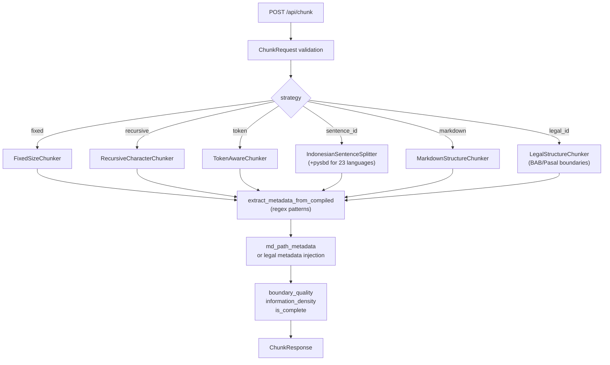
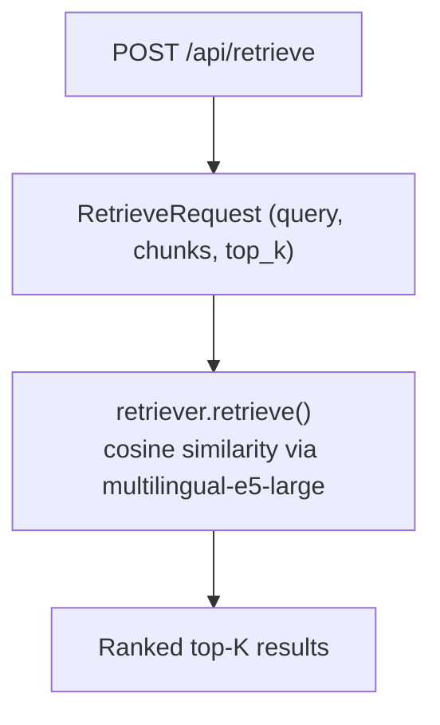

# Architecture

## Request Flow

## Component Overview

### Backend (`backend/`)

| File | Role |
|---|---|
| `main.py` | FastAPI app, CORS, lifespan model warmup |
| `routers/chunk.py` | POST /api/chunk — strategy dispatch, metadata injection |
| `routers/retrieve.py` | POST /api/retrieve — vector similarity |
| `routers/tokenize.py` | POST /api/tokenize — multi-provider estimation |
| `routers/regex.py` | POST /api/regex/test — pattern validation |
| `services/chunker.py` | `chunk_by_strategy()` dispatcher |
| `services/chunkers/` | 6 strategy classes + CHUNKER_REGISTRY |
| `services/retriever.py` | Singleton lazy-load sentence-transformer |
| `services/tokenizer.py` | Async multi-provider: tiktoken, Ollama, mock |
| `services/metadata_extractor.py` | Regex match against compiled patterns |
| `services/quality_metrics.py` | boundary_quality, information_density, is_complete |
| `models/requests.py` | Pydantic v2 request schemas, _VALID_STRATEGIES |
| `models/responses.py` | Pydantic v2 response schemas |

### Frontend (`frontend/src/`)

| File | Role |
|---|---|
| `App.jsx` | Top-level state; passes props to components |
| `hooks/useChunker.js` | Debounced POST /api/chunk, race-condition safe |
| `hooks/useRetrieval.js` | Retrieval state, topK selector |
| `hooks/useRegexPatterns.js` | Pattern array management, on-demand test |
| `hooks/useTokenization.js` | On-demand token estimation, provider/model state |
| `components/StrategySelector.jsx` | Strategy dropdown + per-strategy param controls |
| `components/ChunkGrid.jsx` | Renders chunk cards grid |
| `components/ChunkLegend.jsx` | Explains per-chunk indicators (BQ, ID, overlap, tokens) |
| `components/RetrievalPanel.jsx` | Query input, top-K selector, results |
| `services/api.js` | Axios client (baseURL via VITE_API_BASE_URL) |
| `constants/models.js` | PROVIDERS array: LLM provider definitions |

## Versioning Policy

ChunkLab follows [Semantic Versioning](https://semver.org/) (`MAJOR.MINOR.PATCH`):

| Bump | When |
|---|---|
| **PATCH** (0.2.x) | Bug fixes, documentation corrections, dependency updates |
| **MINOR** (0.x.0) | New features that are backward-compatible (new strategy, new export format, new UI panel) |
| **MAJOR** (x.0.0) | Breaking API changes (`/api/chunk` schema change), removal of a strategy without migration path, incompatible config format change |

A strategy removal (like `sentence` → merged into `sentence_id`) is a MINOR bump when a migration path exists (use `sentence_id` with `language` param).
